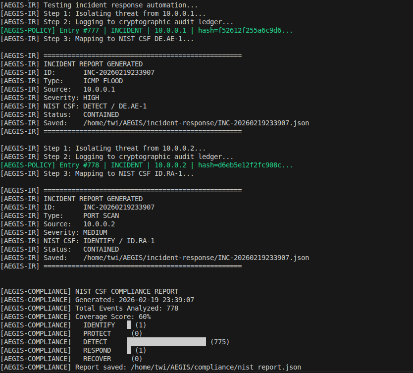
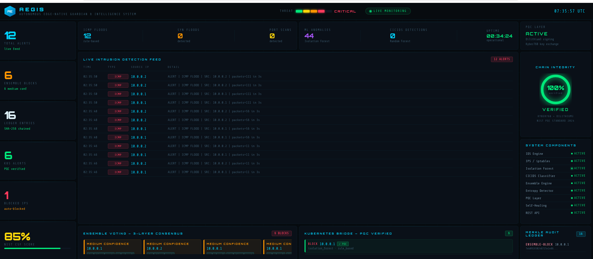
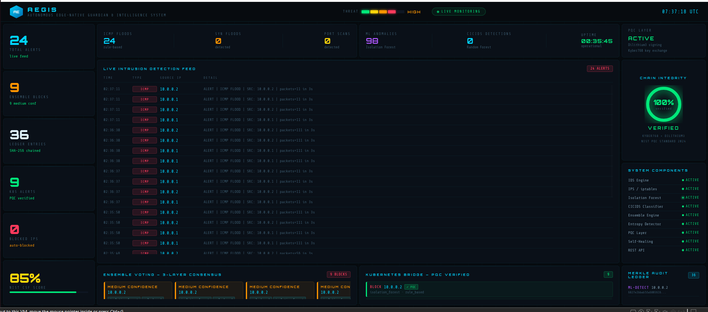
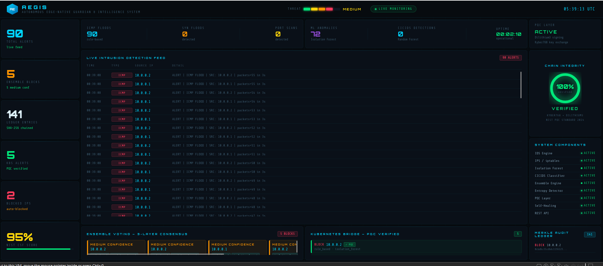
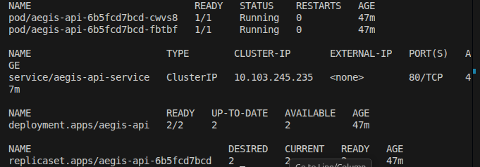
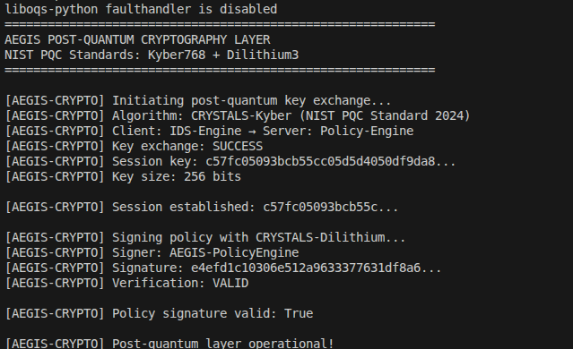

# AEGIS — Autonomous Edge-Native Guardian & Intelligence System

> A unified, self-healing cybersecurity fabric combining real-time intrusion detection, ensemble ML voting, autonomous threat response, cryptographically verifiable audit trails, post-quantum cryptography, and Kubernetes Zero Trust — all integrated into one system.

---

## Table of Contents

1. [The Problem AEGIS Solves](#the-problem-aegis-solves)
2. [Architecture](#architecture)
3. [How The Pipeline Works](#how-the-pipeline-works)
4. [Components](#components)
5. [Cyber Kill Chain Mapping](#cyber-kill-chain-mapping)
6. [XDR — Extended Detection & Response](#xdr--extended-detection--response)
7. [SOAR — Security Orchestration, Automation & Response](#soar--security-orchestration-automation--response)
8. [Model Performance](#model-performance)
9. [Tech Stack](#tech-stack)
10. [Prerequisites](#prerequisites)
11. [Running AEGIS](#running-aegis)
12. [Demo Guide](#demo-guide)
13. [Threat Level Behavior](#threat-level-behavior)
14. [Self-Healing](#self-healing)
15. [Reset for Fresh Demo](#reset-for-fresh-demo)
16. [API Endpoints](#api-endpoints)
17. [What Makes AEGIS Different](#what-makes-aegis-different)
18. [Measured Performance](#measured-performance)
19. [NIST CSF Alignment](#nist-csf-alignment)
20. [Project Structure](#project-structure)
21. [Roadmap](#roadmap)

---

## The Problem AEGIS Solves

Modern organizations run 5–10 disconnected security tools. None talk to each other. A security analyst manually correlates alerts across multiple dashboards while attackers move in minutes. Audit logs can be tampered with. Detection systems use single-layer rule-based approaches that miss novel attacks. Most systems have zero protection against quantum computing threats.

**AEGIS unifies detection, ensemble voting, response, audit, compliance, and self-healing into a single pipeline — everything happens automatically in milliseconds.**

---

## Architecture

```
┌──────────────────────────────────────────────────────────────────┐
│                      AEGIS SECURITY FABRIC                        │
├──────────────────┬────────────────┬─────────────────────────────┤
│   NETWORK LAYER  │  CLOUD LAYER   │     INTELLIGENCE LAYER      │
│                  │                │                             │
│  Mininet         │  Kubernetes    │  Rule-Based IDS/IPS         │
│  Topology        │  Deployment    │  Isolation Forest (ML)      │
│  OVS Switch      │  Zero Trust    │  CICIDS2017 Random Forest   │
│  Attack Sim      │  NetworkPolicy │  Entropy Analyzer           │
│                  │  NodePort      │  Cryptographic Ledger       │
│                  │  Bridge        │  PQC Layer (Dilithium3)     │
├──────────────────┴────────────────┴─────────────────────────────┤
│                    ENSEMBLE VOTING ENGINE                         │
│   3-Layer Consensus: Rule-Based + Isolation Forest + CICIDS      │
│   Majority (2/3) = MEDIUM confidence BLOCK                       │
│   Unanimous (3/3) = HIGH confidence BLOCK                        │
│   Signed with Dilithium3 → Verified in Kubernetes pod            │
├──────────────────────────────────────────────────────────────────┤
│              SOAR — SECURITY ORCHESTRATION LAYER                  │
│  Playbook Engine  │  Case Manager   │  IP Enrichment  │ Notifier  │
│  Kill Chain Map   │  OPEN→CONTAINED │  AbuseIPDB      │ Slack     │
│  ddos.json        │  SLA Tracking   │  Local Fallback │ Console   │
│  port_scan.json   │  Full Lifecycle │  Reputation     │ Webhook   │
│  ensemble_block   │  Kill Chain Tag │                 │           │
├──────────────────────────────────────────────────────────────────┤
│                    SELF-HEALING WATCHDOG                          │
│         Component Recovery + Adaptive Threat Escalation          │
├──────────────────────────────────────────────────────────────────┤
│                      REST API (Flask)                             │
├──────────────────────────────────────────────────────────────────┤
│                     LIVE SOC DASHBOARD                            │
└──────────────────────────────────────────────────────────────────┘
```

## Few Visuals 
















---

## How The Pipeline Works

```
Attack occurs on Mininet network
→ Rule-based IDS flags known pattern (ICMP flood / SYN flood / Port scan)
→ Isolation Forest flags statistical anomaly (unsupervised ML)
→ CICIDS2017 Random Forest classifies attack type (supervised ML, 99% accuracy)
→ All three cast votes to Ensemble Engine
→ Ensemble waits for consensus — majority (2/3) required to BLOCK
→ Ensemble signs alert with Dilithium3 post-quantum signature
→ Signed alert POSTed to Kubernetes pod via NodePort
→ K8s pod verifies Dilithium3 signature — rejects if tampered
→ iptables block rule applied at kernel level (no duplicates)
→ SHA-256 hash chained into tamper-evident audit ledger
→ Watchdog monitors all components — restarts any that crash
→ Adaptive escalation blocks entire subnet after repeat attacks
→ SOAR playbook selected by threat type (DDoS / Port Scan / Ensemble Block)
→ Case created with severity SLA (CRITICAL=5min, HIGH=15min, MEDIUM=60min)
→ IP reputation queried via AbuseIPDB enrichment
→ Kill chain stage mapped and next-stage prediction attached to case
→ Slack alert fired to #aegis-alerts with color-coded severity
→ Incident report auto-generated with NIST CSF mapping + kill chain object
→ Case status updated: OPEN → CONTAINED / INVESTIGATING
→ Flask API exposes everything via REST
→ SOC Dashboard visualizes live — refreshes every 3 seconds
→ Threat level auto-resets to LOW after 30 seconds of no activity
```

Everything above is automatic. No human in the loop.

---

## Components

### 1. Network Topology (`network/topology.py`)
Simulates a real enterprise network using Mininet with Open vSwitch — single switch, 5 hosts, with realistic traffic simulation.

### 2. Rule-Based IDS/IPS (`ids-ips/ids_engine.py`)
Real-time packet inspection using Scapy at the raw socket level. Detects ICMP Flood (>10 packets/3s), SYN Flood (>20 half-open/5s), and Port Scans (>15 unique ports). 1-second alert cooldown prevents alert flooding. Casts vote to ensemble engine.

### 3. ML Anomaly Detection (`ids-ips/ml_detector.py`)
Isolation Forest — unsupervised machine learning trained on normal traffic profiles. Extracts 6 behavioral features per IP per window: packet count, unique ports, SYN ratio, ICMP ratio, average packet size, UDP ratio. Detects anomalies without being told what an attack looks like — catches zero-day threats.

### 4. CICIDS2017 Classifier (`ids-ips/cicids_trainer.py` + `ids-ips/cicids_live.py`)
Random Forest trained on 2,520,751 real labeled network flows from the CICIDS2017 dataset. Achieves 99% accuracy across 7 attack classes: Bots, Brute Force, DDoS, DoS, Normal Traffic, Port Scanning, Web Attacks.

### 5. Ensemble Voting Engine (`ids-ips/ensemble.py`)
The integration layer that makes AEGIS genuinely intelligent:
- All three detectors vote independently
- Majority vote (2/3) = MEDIUM confidence BLOCK
- Unanimous (3/3) = HIGH confidence BLOCK
- 1/3 = ALERT only, no block — prevents false positives
- Every decision signed with Dilithium3 before transmission
- Forwarded to Kubernetes pod with cryptographic proof

### 6. Payload Entropy Analyzer (`ids-ips/entropy_detector.py`)
Shannon entropy analysis on raw packet payloads. Normal traffic: 3.0–5.0 bits. Encrypted C2/exfiltration: 7.2–8.0 bits. Detects encrypted malware tunnels and slow data exfiltration.

### 7. Policy Engine (`policy-engine/policy_engine.py`)
Every security action hashed into a SHA-256 chained ledger. Duplicate iptables rule prevention — each IP blocked exactly once. Modifying any entry invalidates all subsequent hashes. Forensically verifiable.

```json
{
  "action": "ENSEMBLE-BLOCK",
  "src_ip": "10.0.0.1",
  "confidence": "HIGH",
  "voters": ["rule_based", "isolation_forest"],
  "prev_hash": "ce7263c817...",
  "hash": "dea8e54eb1..."
}
```

### 8. Post-Quantum Cryptography (`crypto/`)
NIST PQC Standard 2024 via liboqs — integrated into the actual data flow:
- CRYSTALS-Kyber768 (ML-KEM) — quantum-resistant key encapsulation
- CRYSTALS-Dilithium3 (ML-DSA) — signs every ensemble alert before transmission
- K8s receiver verifies Dilithium3 signature — rejects unsigned/tampered alerts

### 9. Self-Healing Watchdog (`self-healing/watchdog.py`)
Three layers of autonomous recovery:
- Level 1 — Health-checks components every 15s, auto-restarts, logs SELF-HEAL to audit chain
- Level 2 — Same IP blocked 5+ times → escalates to entire subnet block
- Level 3 — Kubernetes reconciliation loop auto-restarts crashed pods

### 10. Kubernetes + Zero Trust (`k8s/`)
- Deployment with replicas always running
- NetworkPolicy — default-deny all ingress/egress (Zero Trust)
- NodePort — exposes receiver at port 30080 for Mininet→K8s bridge
- Real communication — ensemble POSTs signed alerts to K8s pod, pod verifies and stores

### 11. Incident Response (`incident-response/incident_response.py`)
Entry point for the SOAR layer. Receives alert type, source IP, and details from the ensemble engine — delegates execution to the playbook engine, which orchestrates all response steps automatically.

### 12. REST API (`flask_api.py`)
Serves all system data to the dashboard and external tools.

### 13. SOC Dashboard (`soc-dashboard/dashboard.html`)
Live cyberpunk-aesthetic dashboard — intrusion feed, ensemble voting panel, Kubernetes bridge, audit ledger with SHA-256 hashes, component health monitor, chain integrity ring, dynamic threat level. Refreshes every 3 seconds.

---

## Cyber Kill Chain Mapping

AEGIS maps every detected threat to its stage in the Lockheed Martin Cyber Kill Chain framework — giving defenders immediate context on where an attacker is in their campaign and what to expect next.

### The 7 Stages

| Stage | Name | AEGIS Threat | IRIS Signal |
|---|---|---|---|
| 1 | Reconnaissance | PORT SCAN | — |
| 2 | Weaponization | — | — |
| 3 | Delivery | ICMP FLOOD, SYN FLOOD, UDP FLOOD | Prompt Injection |
| 4 | Exploitation | ML ANOMALY, ENSEMBLE-BLOCK | Lateral Movement / Adversarial Data |
| 5 | Installation | — | HIGH_RISK_TOOL_CALL, Permission Violation |
| 6 | Command & Control | ENTROPY HIGH, CORRELATED-ATTACK | AGENT_COLLUSION, Tool Misuse |
| 7 | Actions on Objectives | SOAR-ESCALATE | Data Exfiltration |

### How it works

Every threat is automatically classified at detection time — no manual labelling required.

**SOAR playbooks** print the kill chain stage alongside each incident:
```
[AEGIS-SOAR] Kill Chain: Stage 4 — Exploitation | Next: Expect Installation (foothold via tool misuse or persistence)
```

**XDR correlator** computes attacker progression across all signals in the correlation window:
```
[AEGIS-XDR] Kill Chain   : Stage 1 (Reconnaissance) → Stage 4 (Exploitation)  [skipped stages: [2, 3] — sophisticated attacker]
[AEGIS-XDR] Highest Stage: Stage 4 — Exploitation
```

**Case files** store the kill chain object for every incident:
```json
"kill_chain": {
  "stage": 4,
  "phase": "Exploitation",
  "rationale": "Multi-detector consensus — active exploitation",
  "next_stage": "Expect Installation (foothold via tool misuse or persistence)"
}
```

### MITRE ATLAS integration (IRIS TTPs)

IRIS maps its 5 AI-specific TTPs directly to kill chain stages:

| MITRE ATLAS TTP | ID | Kill Chain Stage |
|---|---|---|
| LLM Prompt Injection | AML.T0006 | Stage 3 — Delivery |
| Craft Adversarial Data | AML.T0043 | Stage 4 — Exploitation |
| ML Model Inference API Access | AML.T0040 | Stage 5 — Installation |
| LLM Plugin Compromise | AML.T0051 | Stage 6 — Command & Control |
| Exfiltration via ML Inference | AML.T0025 | Stage 7 — Actions on Objectives |

### Next-stage prediction

At every detection, AEGIS predicts what the attacker will attempt next:

| Current Stage | Prediction |
|---|---|
| Reconnaissance | Expect Delivery attempt (SYN/ICMP flood or prompt injection) |
| Delivery | Expect Exploitation (ensemble block or divergence detection) |
| Exploitation | Expect Installation (foothold via tool misuse or persistence) |
| Installation | Expect C2 (encrypted tunnel or cross-agent coordination) |
| C2 | Expect Actions on Objectives (data exfiltration or destruction) |
| Actions on Objectives | Attacker at final stage — immediate containment required |

---

## XDR — Extended Detection & Response

AEGIS includes a cross-domain correlation engine that unifies signals from three independent security layers. When 2+ sources detect threats within the same time window, a CRITICAL correlated incident is fired automatically.

### What gets correlated

| Source | What AEGIS reads | Threat types |
|---|---|---|
| **AEGIS** | Audit ledger + IDS alert log | Network floods, port scans, ensemble blocks |
| **IRIS** | `/api/detections`, `/api/collusion`, `/api/events` | Prompt injection, cross-agent collusion, high-risk tool calls |
| **AWS Scanner** | `findings.json` output | IAM/S3/VPC/EC2 misconfigurations |

### Why this matters

A sophisticated attacker might simultaneously:
- Probe the network (AEGIS detects SYN flood / port scan)
- Manipulate an LLM agent to exfiltrate data (IRIS detects divergence / blocked tool call)
- Exploit an open S3 bucket left exposed (AWS Scanner flags it)

Each tool sees one piece. The XDR correlator sees all three and fires a single unified CRITICAL case — something no individual tool can do.

### Running the correlator

```bash
# Single check
python3 xdr/correlator.py

# Continuous daemon (polls every 30s)
python3 xdr/correlator.py --daemon

# Custom window and interval
python3 xdr/correlator.py --daemon --window 10 --interval 60
```

Configure in `.env`:
```
IRIS_API_URL=http://localhost:8000
XDR_WINDOW_MINUTES=5
XDR_POLL_SECONDS=30
```

### What happens on correlation

```
2+ sources fire in same window
→ CORRELATED-ATTACK playbook triggered
→ CRITICAL SOAR case created
→ Slack alert: "AEGIS + IRIS detected simultaneous threats"
→ Incident report saved with full signal breakdown per source
→ Case marked CONTAINED
```

---

## SOAR — Security Orchestration, Automation & Response

AEGIS includes a full SOAR layer that triggers automatically when the ensemble engine confirms a block. No manual intervention required.

### How it works

```
Ensemble confirms block
→ incident_response.py triggered (async thread — doesn't stall voting)
→ Playbook selected by threat type
→ Case created with SLA clock started
→ Steps executed in order: enrich → block → log → notify → NIST map → report → update case
```

### Playbooks

| Playbook | Triggers | Severity | Steps |
|---|---|---|---|
| `ddos.json` | ICMP FLOOD, SYN FLOOD, UDP FLOOD | HIGH | 7 |
| `port_scan.json` | PORT SCAN | MEDIUM | 6 |
| `ensemble_block.json` | ENSEMBLE-BLOCK | CRITICAL | 7 + subnet escalation |
| `generic.json` | Any unclassified event | MEDIUM | 6 |

### Case Lifecycle

Every incident gets a case with full SLA tracking:

```
OPEN → INVESTIGATING → CONTAINED → RESOLVED
```

| Severity | Time-to-Contain SLA | Time-to-Resolve SLA |
|---|---|---|
| CRITICAL | 5 minutes | 30 minutes |
| HIGH | 15 minutes | 60 minutes |
| MEDIUM | 60 minutes | 4 hours |

### IP Enrichment

Each playbook queries the source IP against AbuseIPDB before deciding response:
- **Known attacker (score ≥ 50)** → tagged and flagged in Slack alert
- **Private/internal IP** → local heuristic, no external call
- **No API key** → graceful fallback, enrichment skipped

### Slack Alerts

Color-coded alerts sent to `#aegis-alerts` on every incident:

```
🔴 CRITICAL — ENSEMBLE-BLOCK on 10.0.0.3
   Enrichment: score=87 | country=CN | reports=142
   Steps: enrich → log → notify → nist_map → report → CONTAINED
```

To enable: `export SLACK_WEBHOOK_URL="https://hooks.slack.com/services/..."`

### Running a SOAR test

```bash
python3 incident-response/incident_response.py
```

Output: 3 playbooks execute, 3 Slack alerts fire, 3 cases created, 3 incident JSON reports saved.

---

## Model Performance (CICIDS2017)

```
              precision  recall  f1-score  support
Bots              0.99    0.99      0.99      389
Brute Force       1.00    0.99      1.00      389
DDoS              1.00    1.00      1.00      390
DoS               0.98    0.99      0.99      390
Normal Traffic    0.98    0.99      0.98      390
Port Scanning     1.00    0.99      1.00      390
Web Attacks       0.99    0.98      0.99      390

Overall accuracy: 99% on 2,728 held-out test samples
Training data: 2,520,751 real network flows
```

---

## Tech Stack

| Layer | Technology | Purpose |
|-------|------------|---------|
| Network simulation | Mininet, Open vSwitch | Enterprise network emulation |
| Packet inspection | Scapy | Raw socket IDS |
| Firewall | Linux iptables | Kernel-level IPS |
| ML Unsupervised | Isolation Forest | Anomaly detection |
| ML Supervised | Random Forest | Attack classification |
| Training data | CICIDS2017 | 2.5M real labeled flows |
| Post-quantum crypto | liboqs (Kyber768 + Dilithium3) | NIST PQC Standard 2024 |
| Audit chain | SHA-256 chaining | Tamper-evident ledger |
| Containers | Docker, Kubernetes | Cloud-native deployment |
| Zero Trust | K8s NetworkPolicy | Default-deny networking |
| Self-healing | Python subprocess + K8s | Process + pod recovery |
| API | Flask, Flask-CORS | REST interface |
| Frontend | HTML5, CSS3, JavaScript | SOC dashboard |
| Compliance | NIST CSF | Regulatory mapping |
| SOAR | Custom playbook engine | Orchestration, automation, response |
| Kill Chain | Lockheed Martin 7-stage model | Attack campaign stage classification |
| Enrichment | AbuseIPDB API | IP reputation lookup |
| Alerting | Slack Webhooks | Real-time SOC notifications |

---

## Prerequisites

- Ubuntu 22.04/24.04, Python 3.12+, Docker, 8GB RAM

```bash
# System dependencies
sudo apt install -y python3-pip mininet openvswitch-switch \
  cmake ninja-build libssl-dev python3-dev git curl

# Python packages
pip install scapy flask flask-cors scikit-learn numpy pandas \
  requests joblib --break-system-packages

# Post-quantum cryptography
git clone --recursive https://github.com/open-quantum-safe/liboqs-python
cd liboqs-python && sudo pip3 install . --break-system-packages && cd ..

# Kubernetes
curl -LO https://storage.googleapis.com/minikube/releases/latest/minikube-linux-amd64
sudo install minikube-linux-amd64 /usr/local/bin/minikube
sudo snap install kubectl --classic
minikube start --cpus=3 --memory=4096 --driver=docker

# Generate PQC keypair
sudo python3 crypto/pqc_keys.py

# Train CICIDS model
python3 ids-ips/cicids_trainer.py
```

---

## Running AEGIS

**Step 1 — Reset to clean state:**
```bash
sudo ~/AEGIS/reset.sh
```

**Step 2 — Start Minikube:**
```bash
minikube start
kubectl rollout restart deployment/aegis-receiver -n aegis
```

**Step 3 — Start each component in a separate terminal:**

```bash
# Terminal 1 — Mininet network
sudo mn --topo single,5

# Terminal 2 — IDS Engine
sudo python3 ~/AEGIS/ids-ips/ids_engine.py s1-eth1

# Terminal 3 — ML Detector
sudo python3 ~/AEGIS/ids-ips/ml_detector.py s1-eth1

# Terminal 4 — CICIDS Classifier
sudo python3 ~/AEGIS/ids-ips/cicids_live.py s1-eth1

# Terminal 5 — Ensemble Engine
sudo python3 ~/AEGIS/ids-ips/ensemble.py

# Terminal 6 — Self-Healing Watchdog
sudo python3 ~/AEGIS/self-healing/watchdog.py

# Terminal 7 — Flask API
python3 ~/AEGIS/flask_api.py
```

**Step 4 — Open Dashboard:**
```
Open ~/AEGIS/soc-dashboard/dashboard.html in Firefox
```

---

## Demo Guide

### Simulating Attacks in Mininet

**MEDIUM threat:**
```
mininet> h1 ping -f -c 55 h2
```

**HIGH threat (run twice quickly):**
```
mininet> h1 ping -f -c 55 h2
mininet> h1 ping -f -c 55 h2
```

**CRITICAL threat (run three times quickly):**
```
mininet> h1 ping -f -c 55 h2
mininet> h1 ping -f -c 55 h2
mininet> h1 ping -f -c 55 h2
```

After each attack, AEGIS automatically detects → votes → blocks → recovers. Threat level returns to LOW within 30 seconds.

### Verify Ensemble + K8s Integration
```bash
curl http://192.168.49.2:30080/alerts
```

### Verify Audit Chain Integrity
```bash
curl http://localhost:5000/verify
# Returns: {"integrity": "VERIFIED"}
```

### Demonstrate Self-Healing
```bash
sudo pkill -f ids_engine.py
# Wait 15 seconds — watchdog detects and auto-restarts
```

---

## Threat Level Behavior

Threat level is driven by alerts in the **last 30 seconds** (sliding window):

| Recent Alerts (30s window) | Threat Level | Color |
|---------------------------|--------------|-------|
| 0 | LOW | Green |
| 1–2 | MEDIUM | Yellow |
| 3–4 | HIGH | Orange |
| 5+ | CRITICAL | Red |

**Autonomous reset:** After an attack ends and the IP is blocked, no new alerts are generated. After 30 seconds the sliding window expires and the threat level automatically drops back to LOW — demonstrating the full autonomous detect → respond → recover lifecycle.

---

## Self-Healing

**Level 1 — Component Recovery:**
- Monitors Flask API and IDS Engine every 15 seconds
- Auto-restarts any failed component
- Logs all heal events to the Merkle audit ledger as `SELF-HEAL` entries

**Level 2 — Adaptive Escalation:**
- If the same IP attacks more than 5 times → automatically blocks entire `/24` subnet
- Logged as `ESCALATE` events in the audit ledger

---

## Reset for Fresh Demo

```bash
sudo ~/AEGIS/reset.sh
```

Clears: iptables rules, blocked IPs, all alert logs, ensemble votes.

---

## API Endpoints

| Endpoint | Method | Description |
|----------|--------|-------------|
| `/status` | GET | System health and compliance score |
| `/alerts` | GET | IDS alert feed |
| `/ml-alerts` | GET | ML anomaly alert feed |
| `/cicids-alerts` | GET | CICIDS classifier alert feed |
| `/ledger` | GET | Audit ledger entries |
| `/verify` | GET | Cryptographic integrity check |
| `/health` | GET | Component health status |
| `/blocked-ips` | GET | Currently blocked IPs |
| `/k8s/alerts` | GET | Kubernetes bridge alerts |

---

## What Makes AEGIS Different

**Ensemble Voting — Not Single-Layer Detection:**
Most IDS tools make blocking decisions from a single signal. AEGIS requires consensus across 3 independent detection layers before blocking. This eliminates false positives while maintaining high recall.

**PQC in the Actual Data Flow:**
The Dilithium3 signature is embedded in the real communication channel between Mininet and Kubernetes. Every ensemble alert is signed before transmission and verified on receipt. Tampered or unsigned alerts are rejected.

**Cryptographic Audit Chain:**
Every action — alert, block, self-heal, escalate — is SHA-256 hashed and chained. Modifying any historical entry breaks the entire chain. Tamper-evident and forensically verifiable.

**Real Cross-Environment Integration:**
Mininet and Kubernetes are genuinely connected. The ensemble engine POSTs signed alerts to a K8s NodePort, and the receiving pod verifies the PQC signature before storing.

**Fully Autonomous Lifecycle:**
Detect → Escalate → Block → Recover — no human in the loop at any stage.

---

## Measured Performance

| Metric | Value |
|--------|-------|
| Alert detection latency | < 1ms |
| IPS block application | < 5ms |
| Audit chain entry + hash | < 5ms |
| Ledger verification (500 entries) | < 100ms |
| Watchdog recovery time | < 20 seconds |
| Threat level auto-reset | 30 seconds |
| CICIDS2017 model accuracy | 99% |
| Training dataset size | 2,520,751 flows |
| PQC key generation (Kyber768) | ~0.3ms |

---

## NIST CSF Alignment

| Function | Implementation |
|----------|---------------|
| **Identify** | Network topology mapping, asset discovery via Mininet |
| **Protect** | iptables firewall, PQC encryption (Dilithium3 + Kyber768), policy enforcement |
| **Detect** | IDS + Isolation Forest + CICIDS + Entropy Detector — 4-layer detection |
| **Respond** | Ensemble auto-blocking, incident response playbooks, K8s alert forwarding |
| **Recover** | Self-healing watchdog, adaptive subnet escalation, automatic threat reset |

---

## Project Structure

```
AEGIS/
├── ids-ips/
│   ├── ids_engine.py          # Rule-based IDS — ICMP/SYN/port scan detection
│   ├── ml_detector.py         # Isolation Forest anomaly detection
│   ├── cicids_live.py         # CICIDS Random Forest live classifier
│   ├── cicids_trainer.py      # Offline model training script
│   ├── entropy_detector.py    # Shannon entropy traffic analysis
│   ├── ensemble.py            # 3-layer consensus voting engine
│   ├── aegis_model.pkl        # Trained Isolation Forest model
│   ├── cicids_model.pkl       # Trained CICIDS Random Forest model
│   └── cicids/
│       └── cicids2017_cleaned.csv  # CICIDS2017 training dataset
├── policy-engine/
│   └── policy_engine.py       # iptables management + SHA-256 audit ledger
├── crypto/
│   ├── pqc_keys.py            # Dilithium3 key generation and signing
│   ├── pqc_layer.py           # PQC operations wrapper
│   └── keys/                  # Generated key files
├── self-healing/
│   └── watchdog.py            # Self-healing watchdog + adaptive escalation
├── incident-response/
│   └── incident_response.py   # Automated incident response playbooks
├── network/
│   └── topology.py            # Mininet topology definition
├── k8s/
│   ├── receiver_app.py        # K8s Flask receiver for PQC-signed alerts
│   ├── receiver-deployment.yaml
│   └── Dockerfile
├── xdr/
│   └── correlator.py          # Polls AEGIS + IRIS + AWS, fires SOAR on multi-vector correlation
├── soar/
│   ├── playbook_engine.py     # Loads and executes response playbooks
│   ├── case_manager.py        # Case lifecycle: OPEN → CONTAINED → RESOLVED + SLA
│   ├── kill_chain.py          # Kill chain stage mapping (AEGIS threats + IRIS TTPs)
│   ├── enrichment.py          # IP reputation via AbuseIPDB with local fallback
│   ├── notifier.py            # Slack webhook + console alerts
│   ├── config.py              # Paths, env vars, auto-loads .env
│   └── playbooks/
│       ├── ddos.json          # ICMP/SYN/UDP flood response (HIGH, 7 steps)
│       ├── port_scan.json     # Port scan response (MEDIUM, 6 steps)
│       ├── ensemble_block.json# Consensus block response (CRITICAL, 7 steps)
│       ├── correlated_attack.json # XDR multi-vector response (CRITICAL, 6 steps)
│       └── generic.json       # Catch-all fallback playbook
├── compliance/                # NIST CSF compliance scoring and reports
├── soc-dashboard/
│   └── dashboard.html         # Live SOC dashboard
├── flask_api.py               # REST API (localhost:5000)
├── reset.sh                   # One-command demo reset
├── .env                       # Local secrets — never committed (in .gitignore)
└── README.md
```

---

## Roadmap

- [x] SOAR — playbook engine, case management, IP enrichment, Slack alerting
- [x] XDR — cross-domain correlation across AEGIS (network) + IRIS (AI agent) + AWS Scanner (cloud)
- [x] Cyber Kill Chain — full stage mapping for all AEGIS threats and IRIS MITRE ATLAS TTPs with next-stage prediction
- [ ] LSTM temporal detection for slow-burn attacks spread over hours
- [ ] Istio service mesh with mTLS between all microservices
- [ ] HashiCorp Vault for secrets and certificate management
- [ ] Multi-node Kubernetes cluster with real load distribution
- [ ] ELK Stack for enterprise-grade log aggregation
- [ ] GAN-based adversarial attack simulation for model hardening
- [ ] OpenCTI integration for threat intelligence feeds

---

## Disclaimer

Built entirely in a sandboxed virtual environment for research and educational purposes. All simulated attacks target locally controlled hosts inside a VM. No external systems, networks, or devices were involved.

---

## License

MIT License — see LICENSE for details.

